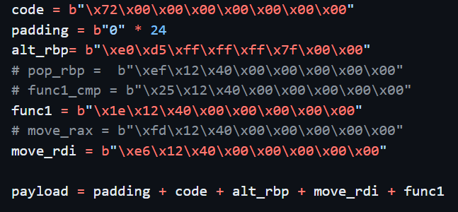
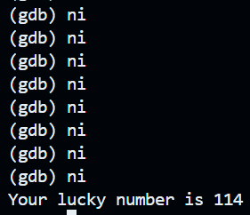

# 栈溢出攻击实验

## 题目解决思路


### Problem 1: 
- **分析**：
  
  反汇编之后，通过阅读汇编代码，我们得知 `main` 的一大部分逻辑都是在读取参数，首先得到 `argv[1]` 是一个文件名，然后再 `fopen` 这个文件，读入文件内容。文件内容可理解为一个字符串，我们可对它自行调整，这里即为用 python 写入的 `ans.txt` 文件。主函数会把内容的地址传给 `func` 函数进行操作。之后，通关的思路比较简单，目标就是想办法让程序最后跳到 `func1` 执行，即可通关。`func` 函数把从文件读到的内容用 `strcpy` 拷贝到一个栈上的小缓冲区 `%rbp-0x8`，只有 8 字节大小，且没有长度检查，所以我们可以直接用溢出覆盖返回地址。
  
  这里的关键是计算偏移量，`buf` 起始地址在 `rbp-0x8`，到 `old %rbp` 是 8 字节，再往上 8 字节就是返回地址，所以覆盖返回地址需要填充 `8 + 8 = 16` 字节。然后 8 个字节，写入 `func1` 的地址 `0x401216`（小端序）。
  
- **解决方案**：
  
  
  
- **结果**：
  程序成功返回到 `func1`，输出通关提示。

  

### Problem 2:
- **分析**：
  
  本题中，`main` 函数的逻辑同上题类似，把文件读到一个 256 字节的缓冲区，再把这个缓冲区地址传给 `func`，`func` 里把目标地址设为 `rbp-0x8`，但 `memcpy` 固定拷贝 `0x38 = 56` 字节导致了溢出。

  我们猜测 `func2` 是通关函数，其中有判断：只有当 `edi == 0x3f8` 才会进入分支，输出通关信息。

  ```assembly
  401225: cmpl $0x3f8, -0x4(%rbp)
  40122c: je   40124c <func2+0x36>
  ```

  先计算返回地址的偏移量，和上一题相同是 `16`。

  接下来我们需要解决“传参”问题，我在程序里找到一个可用的片段，这可以把栈顶的值弹到 `rdi`。在这后面恰好有个 `ret`，在第二次 `ret` 时，要再跳转到 `func2` ，所以需要在第一个返回地址（gadget）后面接着第二个返回地址（`func2`），这样就保证两次 `ret` 根据栈顶的地址都能顺利跳转。
  
  ```assembly
  4012c7: pop %rdi
  4012c8: ret
  ```
  
  最后，本题的跳转逻辑大致为：
  1) 先让 `func` 返回到 `0x4012c7`，执行 `pop rdi` ，把 `0x3f8` 放入寄存器。
  2)  `ret` 到 `func2`，此时满足 `edi == 0x3f8`，输出通关信息并退出。
  
- **解决方案**：
  
  
  
- **结果**：
  
  

### Problem 3: 
- **分析**：
  
  由前几题的经验，现在我们知道，通关的关键都在 `func1` 函数中，可以发现有一个判断逻辑：
  
  ```assembly
  401222:	89 7d bc             	mov    %edi,-0x44(%rbp)
  401225:	83 7d bc 72          	cmpl   $0x72,-0x44(%rbp)
  401229:	75 57                	jne    401282 <func1+0x6c>
  ```
  
  这要求运行到这里时恰有 `$edi = 0x72`，才能进入对应分支，并将输出通关字符串。我考虑用附近的函数 `mov_rdi` 中的片段，它能够将栈里的数据 `-0x8(%rbp)` 存入 `%rdi`，后面的逻辑与 problem 2 类似，再次跳转到 `func1` 的指定位置。
  
  ```assembly
    4012e6:	48 8b 45 f8          	mov    -0x8(%rbp),%rax
    4012ea:	48 89 c7             	mov    %rax,%rdi
    4012ed:	c3                   	ret
  ```
  
  当然最后的跳转还要避免从 func1 的开头就进入，这会导致一些奇怪的问题，以至于 0x72 的值发生丢失，所以我选择直接从 `sub   $0x50,%rsp` 开始进入 `func1` 函数。最后我们得到的跳转逻辑如下。
  
  1. func -> mov_rdi （的后半段）
  
     这里不仅要修改 func 的返回地址，还要保证 rbp 在正确的位置，能够通过 %rbp-8 成功读到 0x72 的数据。所以我们这里在payload 中把 old %rbp 也作了修改，让他不再 leave 时回到上一个栈帧，而是保持现有位置不动，我直接将 %rbp 的这个指针地址覆盖掉了 old %rbp，这样在 leave 之后 %rbp 就不会更改。这样在进入 mov_rdi 时， %rbp-8 就是写入的 0x72，写在了 old %rbp 位置的前 8 个字节中。
  
     这个过程需要确认 %rbp 的绝对地址，我使用了 gdb `layout regs` 进行读取，并且关闭了运行时地址的随机排布，这才保证了写入的 %rbp 就对应着同一位置，使得 %rbp 退出 func 后保持不动。
  
     注意原本 func 预留了 32 个 buffer 空间，这一个 problem 里不再是全部任意填充，而是填充24个，最后 8 个填入 `0x72`（注意小端序）。
  
  2. mov_rdi -> func1
  
     连续 `ret` 跳转方式和上题相同，需要连续填入两个目标地址。
  
  最后得到的 payload 如下。
  
- **解决方案**：

  

- **结果**：

  

### Problem 4: 
- **分析**：
  
  1. 解释 Canary 栈保护机制
     
     每当进入一个函数时，程序在函数入口处从 `%fs:0x28` 取出 canary，保存到当前栈帧中，一般是 `-0x8(%rbp)` 的位置。例如本题中，`main/func/func1` 函数中都能看到类似指令。
     
     函数返回前，将再次读取 `%fs:0x28` 并与栈帧里保存的 canary 做比对，若两者不相等则调用 `__stack_chk_fail@plt` 直接终止运行。若通过栈溢出覆盖返回地址或其他内容，通常会同时破坏 canary，导致这一错误在返回前被检测到，直接导致程序崩溃，无法进行后续操作。
     
  2. 通关方式
     
     此问题中，`main` 中使用 `scanf("%d", &money)` 读入一个 `int` 型数，而`func` 里把门槛设为 `0xfffffffe`，这个数在无符号中为 `4294967294`，有符号则为 `-2`，并使用 `jae/jb` 这类无符号跳转完成判断。
     
     `func` 的逻辑大致如下：
     
     1) 先判断 `(unsigned)money >= 0xfffffffe`，不满足就输出 `your money is not enough!`。
     2) 满足后进入循环：执行 `0xfffffffe` 次 `money--`。
     3) 结束后，检查 `money == 1` 且 `原始输入 == FFFFFFFF`，满足则调用 `func1()` 输出通关提示并 `exit(0)`。
     
     因此，只要让输入在 `scanf("%d")` 后得到 `money == -1 (0xffffffff)`，就能达成通关条件。
  
- **解决方案**：
  
  1. 前两个问题 what's your name / do you like 可任意填写。
  
     > 当然第二个问题是 "Yes" 才对！
  
  2. 当填入“源石数量”时填 `-1`，即可。

- **结果**：

  

## 思考与总结

在问题 1 中，我大致了解到本实验的基本通关方式，main 函数会从 argv 输入参数中读取文件名字符串，然后再从这个文件里读取一大串字符，这串字符如果够长，会由于编码漏洞覆盖到保存的 %rbp 和返回地址等内容。我们的目的就是用设计这串字符，尝试修改代码的运行逻辑，让代码跑到我们指定的位置。当然，越往后需要的思考就越多，问题2、问题3运用了其他代码片段作为 gadgets 来辅助操作。在解题的思考过程中，我也更加理解了栈溢出攻击的方式，也了解到了金丝雀对攻击的防护作用。

## 参考资料

课件 1-10-machine-advanced-preview.pptx
