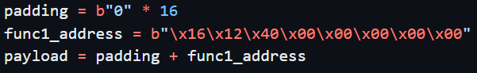
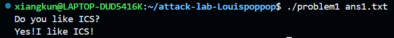
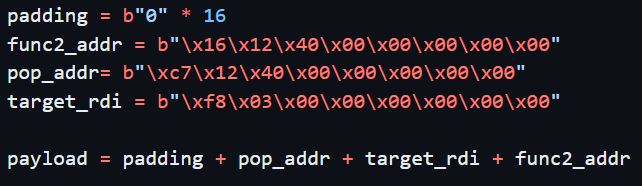
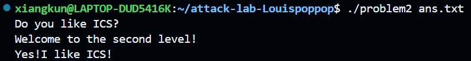

# 栈溢出攻击实验

## 题目解决思路

### Problem 1: 
- **分析**：

- **解决方案**：

  

- **结果**：

  

### Problem 2:
- **分析**：
  
     1. main 读取文件内容到大缓冲区 (256字节)。
     2. main 调用 func，传入大缓冲区数据。
     3. func 内声明了一个只有 8 字节的小缓冲区 (rbp-8)，但 memcpy 拷贝了 56 (0x38) 字节。
     4. memcpy 会溢出：
        - 覆盖 func 栈贞的 rbp (8字节)
        - 覆盖 func 的返回地址 (8字节)
        - 后面还有 56 - 8 - 8 = 40 字节可以覆盖其他内容（如调用者栈空间）。
  
     5. 利用目标：
        - 我们想调用 func2(0x3f8)。
        - func2 地址：0x401216。
        - func2 需要参数 rdi = 0x3f8。
        - 直接跳转到 func2 是不够的，因为参数寄存器 rdi 未必是 0x3f8。
        - 我们需要一个 "gadget" 来设置 rdi。
        - 发现 pop_rdi (0x4012c7: pop %rdi; ret)。
     
     6. 构造 Payload：
        - 填充数据 [8字节] (覆盖 rbp-8 ~ rbp)
        - 填充 Old RBP [8字节] (覆盖 rbp ~ rbp+8)
        - [返回地址位置] 覆盖为 pop_rdi 的地址 (0x4012c7)
        - [下一个栈位置] 放入 0x3f8 (会被 pop 到 rdi)
        - [再下一个位置] 放入 func2 的地址 (0x401216) (pop rdi 后 ret 到这里)
     
  
- **解决方案**：

  

- **结果**：

  

### Problem 3: 
- **分析**：...
- **解决方案**：payload是什么，即你的python代码or其他能体现你payload信息的代码/图片
- **结果**：附上图片

### Problem 4: 
- **分析**：体现canary的保护机制是什么
- **解决方案**：payload是什么，即你的python代码or其他能体现你payload信息的代码/图片
- **结果**：附上图片

## 思考与总结

## 参考资料

列出在准备报告过程中参考的所有文献、网站或其他资源，确保引用格式正确。
